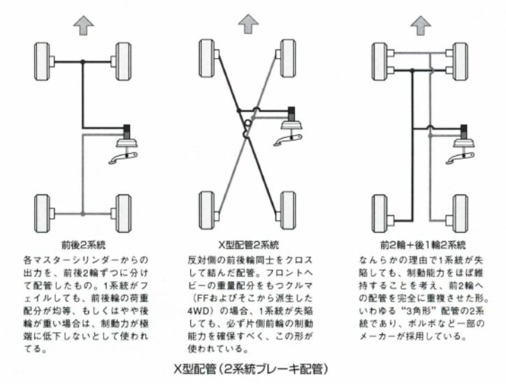
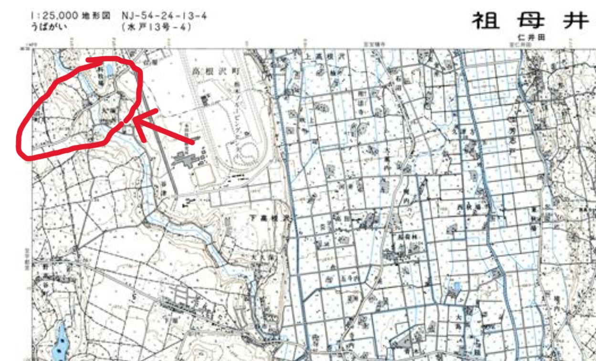
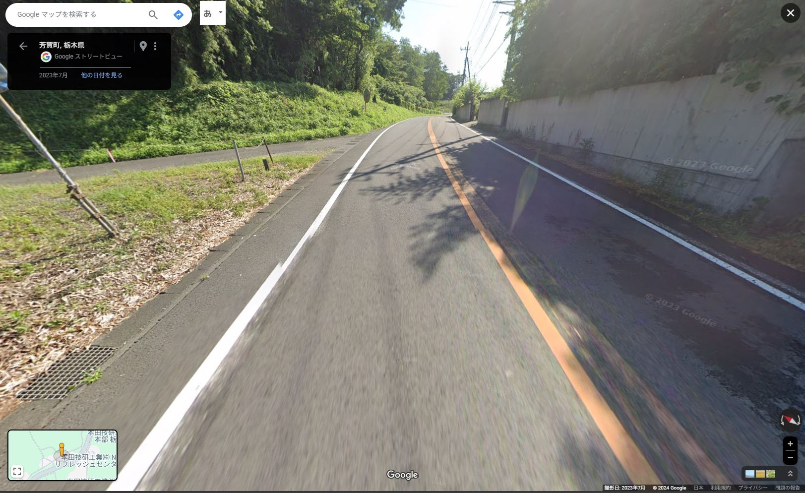
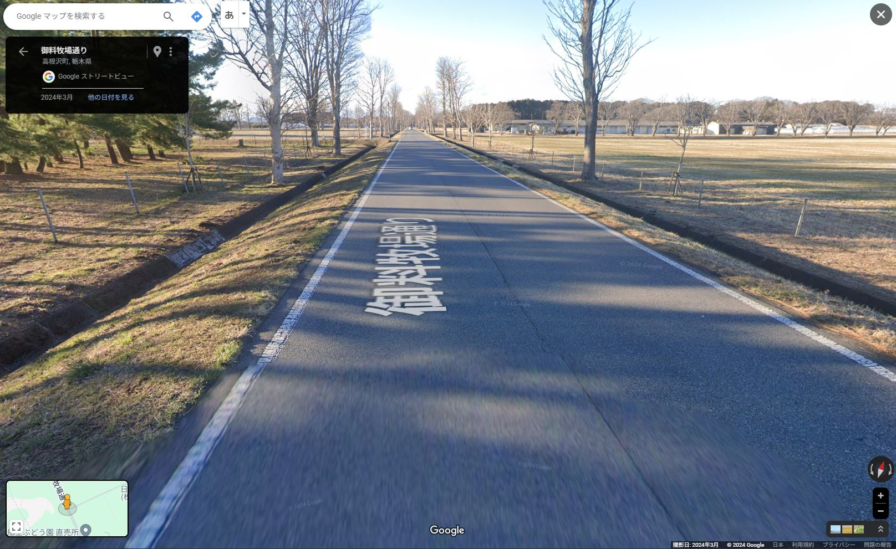
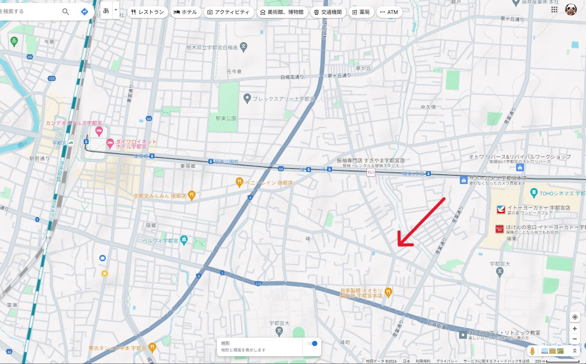
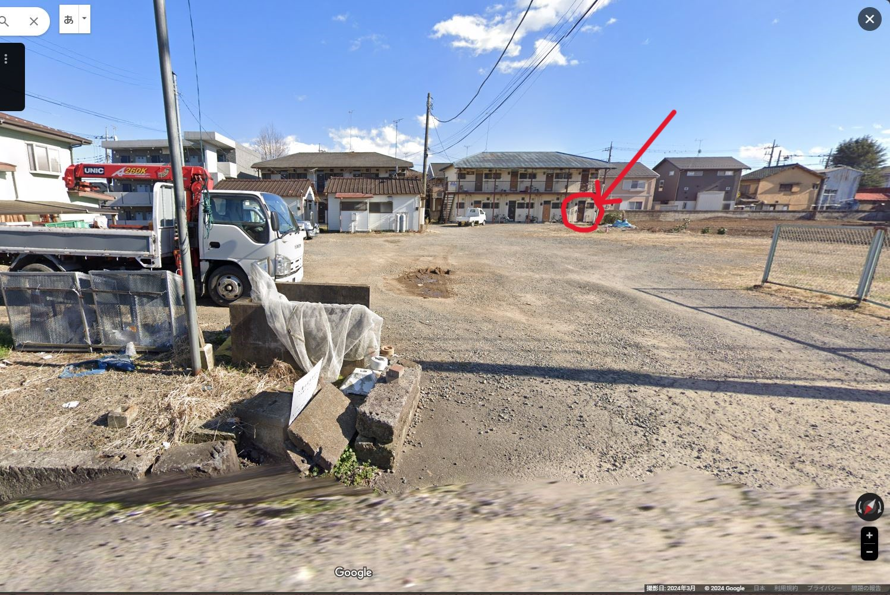
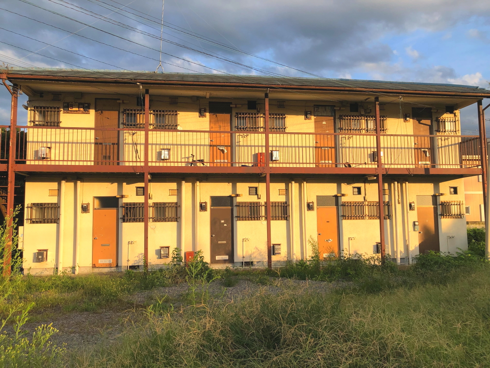
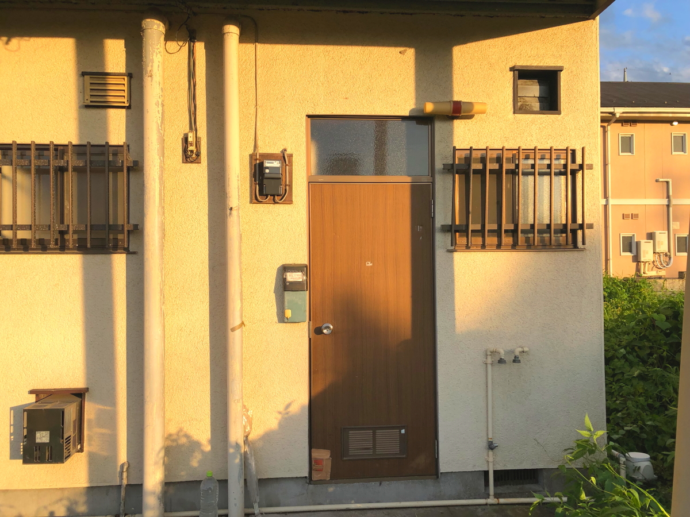

# brake_test

<html>
<head>

<meta charset="UTF-8">
<meta http-equiv="Content-Type" content="text/html; charset=UTF-8">
<meta http-equiv="X-UA-Compatible" content="IE=EmulateIE10" />
<meta http-equiv="X-UA-Compatible" content="IE=edge">

<!--ここから上はお決まりの定型文です-->

<!--ここからが表現の書式などを決めるcssという部分-->

<link href="https://cdnjs.cloudflare.com/ajax/libs/lightbox2/2.7.1/css/lightbox.css" rel="stylesheet">

</head>

<body>

  モバイル端末をお使いの場合は、画面を横向きにすると
  より見やすくご覧頂けます。

 <!--<a href="https://torokoid.github.io/2024Jan_Thailand_2/" target="_blank">-->アクセス用QRコード<!--</a>-->

    
<!--ここまでは定型文としてそのままコピペして再利用します-->
    
<h1><marquee bgcolor="#ffff00">!!! 入社直後で印象に残った、ブレーキの実車テストの思い出です。羽田 !!!</marquee></h1>
    
                         

<!--
<h1>社歴等</h1>

 
<h1>1983年定期採用、オールホンダで600人採用、HGに300人採用された中の一人。 
当時、四輪開発部隊の中心は和光研究所で、エンジンと車体のテスト部隊のみが芳賀町(HGW-T)に配属。 
600人中27人が宇都宮に送り込まれ、1人は即転職、残りの26人での栃木暮らしがスタートしました。 　⇒　のちに栃木26人衆と呼ばれたメンバーです。 
御料牧場を抜けた先の高根沢エリアはまだ未開の地で、 No無しのモトクロッサーがジャンプしながら走り回るような荒野でした。 
配属直後から車体テスト屋生活、ほぼ一日中PGで過ごす生活が10年。 　⇒　車の運転は神業級になり最終的には室課のドライバー訓練イントラ。 
当時Honda3悪と言われた、エンジン・ミッション・ブレーキの一員として、 LAのアメリカン・ホンダに3か月の長滞。20代の感性にはLAは刺激的過ぎ！ 
D開発からR開発に移り、数々のR開発に従事。 
当時CIVICが初めてアイドルストップしたが、 上り坂で停車後再スタートでエンジンスタートまでの一瞬で後ろに下がる現象でクレーム多発。 　⇒　これを阻止するCAS（Creep Aid System）開発。 
CMBS（自動ブレーキ）の初期開発で追突ギリギリまで前車に突っ込むあり得ないテスト実施。 ・・・このメンバーとは今でも交流があります。 
D室課に戻ってCMBSの量産適用を見極めてホッとしたところで、2000年に立ち上がった「商品技術戦略室」に配属。 
最初は6年で卒業したが、その後ことあるごとに企画系の部署にちょくちょく戻る人生となりました。 
2008年～2012年は和光研究所の未来研で様々な業務に従事。 
　⇒　当時は絵に描いた餅だったITS系のシステムが、次々と現実になっていくのを目にしながらの卒業となりました。 </h1>

 

 
<h2>1980年代の宝積寺エリアと会社周辺の地図、クリックで白地図サイトの地図に飛びます 
    鬼怒川の橋を渡ったエリアは道が通っただけの未開地、今は立派な街です。</h2>

  

 
<h2>会社内の建物は総務・食堂エリアと、東側に伸びた７Kエリアが確認できます。 
    西側の道路は樫の森公園で行き止まり、夜には元気な若者たちがゼロヨンで盛り上がってました。</h2>

 
<h2>1980年頃までは宇都宮駅に東口はありませんでした。 
    配属メンバーはほぼ東口側に住んで柳田街道で出社しますが、途中から砂利道。 
    橋を渡ると左折して山道を分け入っての通勤でした。</h2>

-->

<h1>入社直後に配属された7K, BrakeGrで印象に残った業務内容</h1>

 
<h1>1983年10月に栃木配属、その後２ヶ月の実習期間を経てBrakeGrに正式配属。 
当初は市場クレーム頻発中のブレーキ鳴きの研究解析チームで解析業務。 今でも運転中に自車や周辺車のブレーキ鳴きが聞こえてしまう職業病は治らず。 
50代に入ると10,000Hz超えの高周波は聞こえなくなったは救い。 
ブレーキ鳴きの仕事はメンバー入れ替えになり、 その後は実車テスト部隊として様々なテスト業務に。 
中でも印象に残ったのは、箱根降坂テストと、JARIの高速ブレーキテスト。 
以下触りの部分のみですが、ざっと紹介させて頂きます。</h1>

	
	
                         
                          

<h2>箱根ターンパイクの下り坂を使って、ブレーキの熱容量の妥当性を確認します。</h2>

<h2>ターンパイクは夜間は閉鎖されるので、道路事業者と夜間専用使用の取り決め。 
通行料などを徴収する管理事務所に一升瓶を持参してご挨拶からスタート。 
次の重要業務はブレーキの組み替えなどを行うパーキングに残ったアベック車両の追い出し。</h2>

<h2>JARIの高速周回路で最高速からのブレーキテスト。 規程の距離内で止まれないと法規フェール。 
最も危険なのは一系統失陥高速ブレーキテスト。</h2>

      

<h2>S58年頃の通勤路。</h2>

<h2>S58年頃の通勤路風景。</h2>

<h2>宮内庁、御料牧場の直線道路。</h2>

      

<h2>S58年10月に最初に住んだところ。</h2>

<h2>周辺は整地されていましたが、アパートはまだありました。(GoogleMaps映像)</h2>

<h2>7月31日に定時退社で実際に現地確認した映像。</h2>

<h2>当時は全く想像できなかったLRT。</h2>

<iframe width="560" height="315" src="https://www.youtube.com/embed/wNlAnME3SUE?si=VX74ye_ueC9wsC1I" title="YouTube video player" frameborder="0" allow="accelerometer; autoplay; clipboard-write; encrypted-media; gyroscope; picture-in-picture; web-share" referrerpolicy="strict-origin-when-cross-origin" allowfullscreen></iframe>

<!--

    
<h2>タイ人達の車のインパネには、ほぼ漏れなく仏像が鎮座、 この車にはルームミラーからもぶら下がってます</h2>

    
<h2>タイヤがはみ出すのは合法らしい</h2>

    
<h2>パーキングではボンネット開けて冷却する車が散見されました</h2>

    
<h2>高速で荷台に乗るのも合法、この車には3人乗ってました</h2>

    
<h2>高速で移動したのはプーケットに並ぶリゾート地のパッタヤ</h2>

<h2>観光地はロシア人が目立ちます 
        ロビーにはヘッドギヤで通話するおじさん</h2>

    
<h2>可愛らしい女の子連れたロシア人、後ろの席にいるのがお父さんでした 
    この家族は徴兵回避でタイに避難している一家ですね。</h2>

    
<h2>中国人も居ましたが、ごく少数</h2>

    
<h2>パッタヤの屋外型レストラン、ほぼ外国人しかいません。 
    日本人は若者が一組だけ確認できました</h2>

    
<h2>ディナータイムはほぼ満席になりました</h2>

    
<h2>BGMは生演奏でした</h2>

<iframe width="900" height="506" src="https://www.youtube.com/embed/GJDF14UrWgk" title="YouTube video player" frameborder="0" allow="accelerometer; autoplay; clipboard-write; encrypted-media; gyroscope; picture-in-picture; web-share" allowfullscreen></iframe>
    
<h2>パッタヤを堪能した後はバンコクに戻り、市場でお買い物 この部分はFaceBookからの引用となります 右上のFマーククリックでFaceBookに飛びます</h2>

<iframe src="https://www.facebook.com/plugins/post.php?href=https%3A%2F%2Fwww.facebook.com%2Fsatoshi.hada.12%2Fposts%2Fpfbid0F4okdyLUiwMUh2rWAFQseLUq8oZTPFkfdRj2y1yi6xH11ATEw3McwRrLL2PTZnzBl&show_text=true&width=500" width="500" height="684" style="border:none;overflow:hidden" scrolling="no" frameborder="0" allowfullscreen="true" allow="autoplay; clipboard-write; encrypted-media; picture-in-picture; web-share"></iframe>
    
    
<h2>次は北部の都市チェンライに移動、有名なチェンマイの北東に位置します</h2>

    
<h2>人口でタイ8番目の都市チェンマイの北東部の都市がチェンライです 
        ちなみに以前はチェンマイが2番目の都市だったようです</h2>

    
<h2>スクーターに一家4人で乗ります、ハンドルを握るのはお母さん</h2>

    
<h2>地方都市の朝市、さすがに外国人は私たちだけでした</h2>

    
<h2>バナナ売り場の内側からハイポーズ</h2>

    
<h2>洒落た喫茶店があったので一休み</h2>

	

	
<h2>店員さんが満面の笑みでピースサイン 
        しゃべるまで男だとは分かりませんでした 
	よく聞いたら、なんと親戚！</h2>

    
<h2>車で１時間ほど北上すると、国境の街メーサーイ</h2>

    
<h2>アーケード街はあまりにも巨大なので、中の移動はスクーターの様です</h2>

    
<h2>物流の拠点らしく、さまざまな商品が並びます</h2>

    
<h2>ミャンマーとの国境ゲートの門</h2>

    
<h2>門の向こう側はミャンマーです</h2>

    
<h2>トイレは有料で５バーツ・・・約20円</h2>

    
<h2>別のトイレですが、タイのトイレの標準的な装備 
        左に見えるシャワーが手動のウォシュレット、 おしりを吹いたティッシュはトイレに流さずゴミ箱に捨てる決まりなので要注意！</h2>

    
<h2>東に移動してラオス国境の近くの寺院を訪問</h2>

    
<h2>タイの犬は全て放し飼いでした</h2>

    
<h2>ご本尊は煉瓦積みの筒の中らしいです</h2>

    
<h2>お賽銭箱(壺)</h2>

    
<h2>若い修行僧が瞑想していましたが、完全に飽きてスマホ覗いてます</h2>

    
<h2>おみくじは生まれた曜日で引く決まりで木曜は午前午後も切り分け 左から日、月、火、水、木AM、木PM、金、土</h2>

    
<h2>お寺の説明もQRコードでDX対応 
        この画面からでも読み込めます</h2>

    
<h2>真ん中のQRコードのリンク先 
        動画の中の川がメコン川、川の向こうはラオスです</h2>

<iframe width="900" height="506" src="https://www.youtube.com/embed/mg_G4sBS_Hk" title="YouTube video player" frameborder="0" allow="accelerometer; autoplay; clipboard-write; encrypted-media; gyroscope; picture-in-picture; web-share" allowfullscreen></iframe>

    
<h2>カーボンのロードバイク5台も積んだトラック</h2>

    
<h2>尼寺エリアの尼さん達が妻との記念撮影に応じてくれました</h2>

    
<h2>尼寺エリアにはふつう男性は入れませんが、奥様の知り合いパワーで潜り込みます</h2>

    
<h2>1時間弱南下してショッピングモールを訪問</h2>

    
<h2>子供たちはトラックの荷台が大好き</h2>

    
<h2>入り口の脇には宝くじ売り場、このスタイルはたくさん見ました</h2>

    
<h2>ショッピングモールはかなりの規模でした</h2>

    
<h2>フードコートでタイラーメンをいただきました</h2>

    
<h2>夜のイルミネーションはかなり独特</h2>

    
<h2>制服の背中が落書きだらけの女子高生</h2>

    
<h2>絵画の展示即売会開催中 （撮影がフリーなのはタイの緩いところ）</h2>

    
<h2>背景画像はこの絵です</h2>

	

    
<h2>作者は仏歴2517年、2517 - 543 = 西暦1974年生まれの49歳</h2>

    
<h2>展示会の部分もFaceBookの記事がありますのでリンク貼ります</h2>

<iframe src="https://www.facebook.com/plugins/post.php?href=https%3A%2F%2Fwww.facebook.com%2Fsatoshi.hada.12%2Fposts%2Fpfbid0NxwngLeYS2qb1fvJ4GndNRHzj7bfsFaXdRArcDJhxqjj1NdnVzCzKqUceSF2wErPl&show_text=true&width=500" width="500" height="601" style="border:none;overflow:hidden" scrolling="no" frameborder="0" allowfullscreen="true" allow="autoplay; clipboard-write; encrypted-media; picture-in-picture; web-share"></iframe>

    
<h2>北部方面にしかない、竹の筒の中に詰めたもち米のごはん ・・・・バンコクにはありません・・・・</h2>

    
<h2>空港内の赤鬼青鬼はマスクしてました</h2>

    
<h2>鬼と人間が大蛇で綱引きするオブジェ</h2>

    
<h2>空港内には王室直営店もありました</h2>

    
<h2>深夜便で移動して2023年2月26日朝7時に成田空港着</h2>

    
<h2>帰り道の筑波山が綺麗でした。</h2>

    
<h2>宇都宮の梅は満開中。</h2>

    
<h2>位置情報の取得方法</h2>

<h2>今回の移動ではAPRS信号で位置情報を取得しました。 
APRSとはアマチュア無線機でGPS情報を共有する仕組みですが、 
日本の無線機を海外で勝手に使うのは違法行為となります。 
今回はスマホアプリの無線機で代用しています。</h2>

    
<h2>タイのアマチュア無線家たちも位置情報出してます</h2>

    
<h2>ミャンマーとラオス、ベトナムはゼロ、中国は都市部で信号が出てました</h2>

	
  
<h2><a href="https://yamap.com/activities/3245546" target="_blank" class="p">
APRSの簡単説明、5分でわかるAPRS,リンク
</a></h2>
-->

                         
                          

<footer>
    <h2>Copyright S.Hada 2024/Aug/30 @ 入社当時のお仕事</h2>
</footer>
    
<!--HPにさまざまなJavaScriptを呼び込むための書式-->

</body>

</html>
